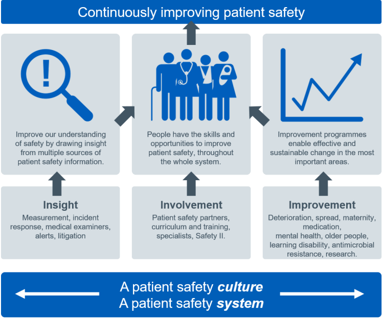
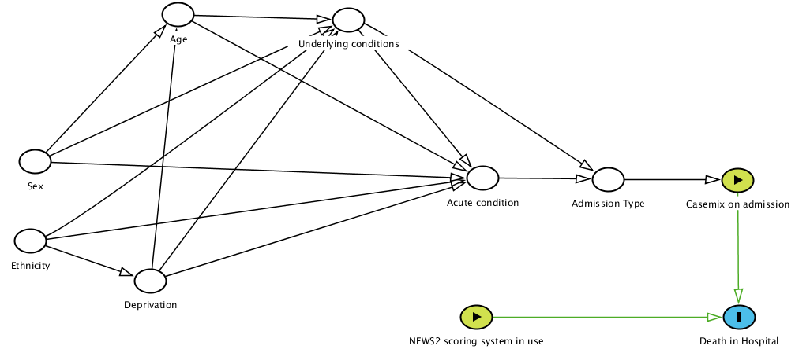

```{r setup, include=FALSE}
library(ragg)
library(RefManageR)
BibOptions(check.entries = FALSE, bib.style = "authoryear", style = "text",
           dashed = FALSE, cite.style="authoryear", longnamesfirst=FALSE)

#file.name <- system.file("Bib", "", package = "RefManageR")
bib <- ReadBib("References.bib")

options(htmltools.dir.version = FALSE)
knitr::opts_chunk$set(
  fig.width=9, fig.height=3.5, fig.retina=3,
  out.width = "100%",
  cache = FALSE,
  echo = TRUE,
  message = FALSE, 
  warning = FALSE,
  hiline = TRUE,
  dev = "ragg_png"
)
```

```{r R-Lang, echo=FALSE}
# Choose the language at the beginning of your script or knit from external file
lang <- c("EN", "FR")[1]
```

class: title-slide

# Analytics & Measurement in Patient Safety

<br><br>

### A wander through my personal experience 
### and work in the NHS


<br><br>

###   Dr Chris Mainey

`r icons::icon_style(icons::fontawesome("envelope"), fill = "#005EB8")` [c.mainey@nhs.net](mailto:c.mainey@nhs.net)
`r icons::icon_style(icons::fontawesome("twitter"), fill = "#005EB8")` [@chrismainey](https://twitter.com/chrismainey)
`r icons::icon_style(icons::fontawesome("github"), fill = "#005EB8")` [chrismainey](https://github.com/chrismainey)
`r icons::icon_style(icons::fontawesome("linkedin"), fill = "#005EB8")`  [chrismainey](https://www.linkedin.com/in/chrismainey/)
`r icons::icon_style(icons::fontawesome("orcid"), fill = "#005EB8")` [0000-0002-3018-6171](https://orcid.org/0000-0002-3018-6171)
`r icons::icon_style(icons::fontawesome("globe"), fill = "#005EB8")` [www.mainard.co.uk](https://www.mainard.co.uk)

.footnote[Presentation and code available: **https://github.com/chrismainey/PS_measurement**]

.art_cap[R generative art - inspired by Antonio Sánchez Chinchón - @aschinchon]


---
class: inverse center middle

.pull-left[
<br>
## Background, and progression to this role
]

.pull-right[
</img><p><a href="https://giphy.com/gifs/curbyourenthusiasm-season-10-curb-season10-H5Ax4wLi7D7Elausl4">via GIPHY</a></p>
]


---

# Analytical  career

+ Didn't start as an analyst

--

+ Public Health - Cancer registry on to "Cancer Network."

--

+ Acute trust informatics - exposure to production databases

--

+ Progression to senior analyst
  + Responsible for statistics models
  + Started MPH course

--

+ PhD in applied statistics and ML, on how to use incident reporting data

--

+ Developed Senior Data Scientist role and Data Science team + external relationships

--

+ Taken role in National Patient Safety Team

---

#  Essential experience

.pull-left[
+ Excel
+ Relational Databases:
  + Structure
  + SQL
+ Summary Statistics
+ Data Visualisation
+ Dashboarding
+ Presentation to others


__It's OK to not understand, but work with people who do...__

]

.pull-right[


]

---
# Better Skills:

.pull-left[

+ Asking the right question
+ Sector knowledge / dataset knowledge
+ Study design / how to answer questions
+ Statistical analysis / modelling
+ Collaborative working
  + With other disciplines / clinical colleagues

__You can't be good at everything, specialising is good__

]

.pull-right[
 

 
 ]

---

# Top skills:

.pull-left[
 
+ Designing measurement / analytical plans
+ Balancing detail / signal and story
+ Reproducible Analytical Pipelines (RAP)
+ Within analysis projects
+ Communicating uncertainty in analysis
+ Causal Inference
+ Ability to apply emerging methods

__Too many specialties...can't keep up with everything...__

 ]

.pull-right[


]

  
---
class: inverse middle

# National Patient Safety Team at NHSEI

---
.pull-left[
## The Patient Safety Strategy

<br>
### Insight

<br>
### Involvement

<br>
### Improvement

]

.pull-right[

</p>

]

.footnote[
https://www.england.nhs.uk/patient-safety/the-nhs-patient-safety-strategy/#patient-safety-strategy
]


---
class: inverse middle

## Workstream 1: Analysis of incident reporting data

---

# Using Incident reporting data

+ Clinical (qualitative review) is major method
+ Finding relevant incidents
+ Quantitative approaches being reduced deliberately
+ Natural Language Processing (NLP)

---
class: inverse middle

## Workstream 2: Measurement for the Patient Safety Improvement Programmes (SIPs)
---

.pull-left[
## QI & SIPs

+ Quality Improvement now established as a discipline, with it's methods: PDSA cycle & variations: (Lean / Six-sigma etc.) 

+ Difficult for analysts to appreciate differences in monitoring, improvement, assurance etc.

{{content}}

]

.pull-right[
<p align="center"></p>

__IHI and API improvement process diagram: http://www.apiweb.org/__
]

--

+ 'Quality' and 'Patient Safety' something of a pseudo-science:
  + Psychology
  + Human Factors
  + Process control (Shewhart / Deming)

{{content}}
  
--

+ Contrasts with Donabedian model:
  + Structures
  + Process
  + Outcomes

---

# Methods

+ Depends the question!!!

.pull-left[

### Run charts & SPC

```{r spc, echo=FALSE, fig.height=4, fig.width=6, message=FALSE, warning=FALSE}
library(NHSRplotthedots)
library(NHSRdatasets)
library(tidyverse)

sub_set <- ae_attendances %>% 
  filter(org_code == "RQM", type == 1, period < as.Date("2018-04-01"))

sub_set %>%
  ptd_spc(value_field = breaches, date_field = period, improvement_direction = "decrease")

```

]

.pull-right[
### Funnel Plots

```{r funnel, echo=FALSE, fig.height=4, fig.width=6, message=FALSE, warning=FALSE}
library(FunnelPlotR)
library(COUNT)
library(ggplot2)

# lets use the 'medpar' dataset from the 'COUNT' package. Little reformatting needed
data(medpar)
medpar$provnum<-factor(medpar$provnum)
medpar$los<-as.numeric(medpar$los)

# Build glm to predict los (count so Poisson assumption)
mod<- glm(los ~ hmo + died + age80 + factor(type), family="poisson", data=medpar)

# Predict on to dataset
medpar$prds<- predict(mod, type="response")

b<-funnel_plot(numerator=medpar$los, denominator=medpar$prds, group = medpar$provnum, data_type = "SR",
            title = 'Length of Stay Funnel plot for `medpar` data', draw_unadjusted = FALSE,
            draw_adjusted = TRUE, sr_method = "SHMI", label="outlier", limit=99)


b <- plot(b) +
  guides(color=guide_legend(nrow=2, byrow=TRUE))+
  theme(panel.grid = element_line(color = "grey70")
        ,  plot.background = element_rect(color = "grey", size = 1) # border around whole plot
        ,  plot.margin = unit(c(5, 5, 5, 5), "mm"))

print(b)

```
]

---

# Methods

.pull-left[
+ Statistical analysis:
  + Hypothesis testing
  + Generalized Linear Modelling (e.g linear regression, logistic regression)
  + Time series (e.g. ARIMA)
]

--


https://xkcd.com/552/

--

.pull-right[
## Causal Inference

+ Consider causal pathway!!!

{{content}}

]

--

+ Difference-in-Difference
+ Regression Discontinuity analysis


---
class: middle inverse

# Example: NEWS2 Deterioration Scores and mortality

---

## Current progress on Causal Path

<p align = "center"></p>


> _"...Since all models are wrong the scientist must be alert to what is importantly wrong. It is inappropriate to be concerned about mice when there are tigers abroad..."_

.footnote[Box, G. E. P. (1976). "Science and Statistics". In: Journal of the American Statistical Association 71.356, pp. 791-799. DOI: 10.1080/01621459.1976.10480949. URL: https://www.tandfonline.com/doi/abs/10.1080/01621459.1976.10480949.]


---
class: inverse center middle
.pull-left[

]

.pull-right[

<br><br><br><br><br><br>


__Source:__ xkcd: A webcomic of romance, sarcasm, math, and language

'Curve-Fitting Methods and the messages they send'

https://xkcd.com/2048/
]
